# Netflix Movies and TV Shows Data Cleaning, EDA & Visualization

[](https://www.python.org/)
[](https://pandas.pydata.org/)
[](https://seaborn.pydata.org/)
[](https://opensource.org/licenses/MIT)

An end-to-end, portfolio-grade Data Analytics project demonstrating data pipeline creation, quality assessment, professional data cleaning, exploratory data analysis (EDA), and advanced data visualization using Python.

---

## 📌 Project Overview & Business Case

With over 200 million subscribers, Netflix is a global leader in the streaming industry. Understanding its content catalog is essential for content acquisition, region-specific programming, and budget allocation. 

This project explores the **Netflix Movies and TV Shows dataset** (comprising over 8,800 titles). By parsing and analyzing this raw catalog data, we uncover patterns in content growth, release trends, geographic distribution, runtime preferences, and genre popularity.This project was completed to simulate a real-world Data Analyst workflow.
---

## 🎯 Project Objectives

- **Data Profiling & Quality Assessment**: Identify missing data patterns, duplicates, parser shifts, and formatting inconsistencies.
- **Professional Data Cleaning**: Build a programmatically repeatable cleaning pipeline in Python (handling shifted rows, missing data, and type conversions).
- **Exploratory Data Analysis (EDA)**: Formulate and answer 14 distinct analytical business questions.
- **Advanced Visualizations**: Create 12 publication-ready plots styled in a custom, Netflix-inspired theme.
- **Strategic Recommendations**: Convert data findings into high-level business decisions for platform growth.

---

## 🛠️ Technologies & Libraries Used

- **Language**: Python 3.10+
- **Data Manipulation**: Pandas, NumPy
- **Data Visualization**: Matplotlib, Seaborn
- **Development Tooling**: Modular script execution

---

## 🗃️ Dataset Information

The raw dataset contains **8,807 rows** and **12 columns** representing Netflix's catalog up to mid-2021:

| Column Name | Data Type | Description |
| :--- | :--- | :--- |
| `show_id` | Object (String) | Unique identifier for each movie or TV show. |
| `type` | Object (String) | General category of content (`Movie` or `TV Show`). |
| `title` | Object (String) | Title of the movie or TV show. |
| `director` | Object (String) | Director(s) of the show (comma-separated). |
| `cast` | Object (String) | Lead and supporting cast members (comma-separated). |
| `country` | Object (String) | Country or countries of production (comma-separated). |
| `date_added` | Object (String) | Date the title was added to Netflix. |
| `release_year` | Integer | Original release year of the show. |
| `rating` | Object (String) | Content rating (e.g., TV-MA, PG-13, TV-14). |
| `duration` | Object (String) | Original runtime (minutes for Movies, seasons for TV Shows). |
| `listed_in` | Object (String) | Genres the show is classified under (comma-separated). |
| `description` | Object (String) | Brief summary of the show's plot. |

---
## Key Metrics

- Dataset Size: 8,807 records
- Features: 12 original columns
- Missing Values Resolved: 100%
- Visualizations Created: 12
- Business Insights Generated: 10+

## 🔄 Project Pipeline & Workflow

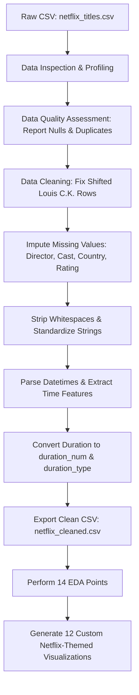

### 1. Data Quality Audit & Assessment
An initial scan of the raw data revealed key structural issues:
- **Null Fields**: `director` (~30% missing), `country` (~9.4% missing), `cast` (~9.3% missing).
- **Parser Alignment Shift (Louis C.K. Standups)**: Three rows (`Louis C.K. 2017`, `Louis C.K.: Hilarious`, and `Louis C.K.: Live at the Comedy Store`) had their movie duration values misaligned into the `rating` column (e.g., `'74 min'`), leaving the `duration` column null.
- **Datetime Format Spacing**: The `date_added` column contained leading and trailing whitespaces that caused standard parser conversions to fail for 88 rows.

### 2. Implementation of Data Cleaning Strategy
The script programmatically resolves these issues to prevent data leakage and bias:
- **Shift Correction**: Automatically detects rows where `duration` is missing but `rating` contains `'min'`. Shifts these values back to `duration`, and replaces the rating with `'UR'` (Unrated).
- **Whitespace Cleaning**: Strips all leading/trailing whitespaces from string columns.
- **Categorical Imputation**: 
  - `director` $\rightarrow$ `'Unknown Director'` (prevents bias from dropping 30% of records).
  - `cast` $\rightarrow$ `'Unknown Cast'`.
  - `country` $\rightarrow$ `'Unknown Country'` (prevents artificial inflating of United States counts).
  - `rating` $\rightarrow$ `'UR'` (Unrated) for the 4 actual missing rating rows.
- **Temporal Cleaning**: 
  - Drops the 10 rows with missing `date_added` (0.11% of the dataset) to preserve strict time-series trends.
  - Strips and parses `date_added` to datetime, extracting `year_added`, `month_added`, and `month_num_added`.
- **Feature Engineering**: Splitting `duration` into:
  - `duration_num` (numeric runtime or season count).
  - `duration_type` (categorical unit: `'min'` or `'Season'`).
- **Exporting**: Outputs the final clean and verified dataset as `netflix_cleaned.csv`.

---

## 📈 Visualizations & Business Insights

The visualizations are built using a **custom design system** styled in Netflix's brand colors (Primary Accent: `#E50914`, Charcoal Background: `#221F1F`, Warm White: `#F5F5F1`).

---

### 1. Content Composition (Movies vs. TV Shows)
We analyze the distribution of content types to establish a baseline of the catalog.

| Donut Chart: Type Distribution | Bar Chart: Volume Comparison |
| :---: | :---: |
| 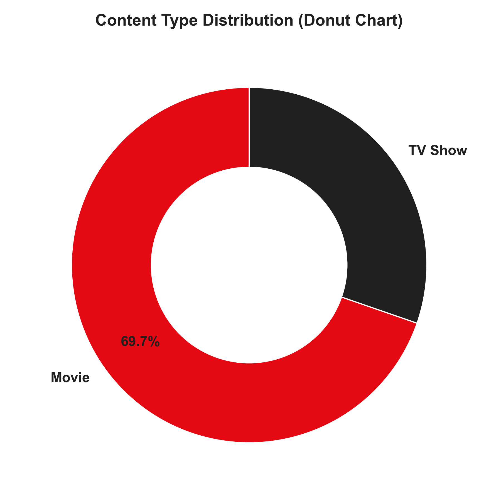 | 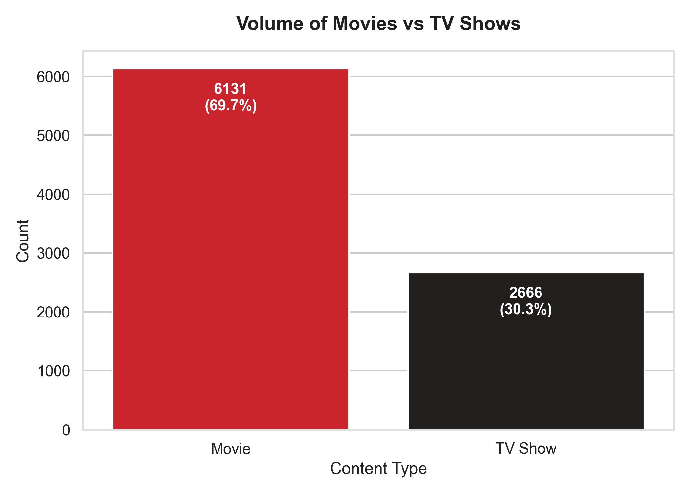 |

> 💡 **Business Insight:** 
> Movies constitute **69.7%** of the catalog, while TV shows make up **30.3%**. Although Movies are cheaper to acquire and offer direct volume, TV shows are critical for increasing user screen time, encouraging recurring subscription renewals, and reducing customer churn.

---

### 2. Geographic Production Hubs (Exploded Analysis)
Shows with multiple production countries were split ("exploded") to count every country's contribution fairly.

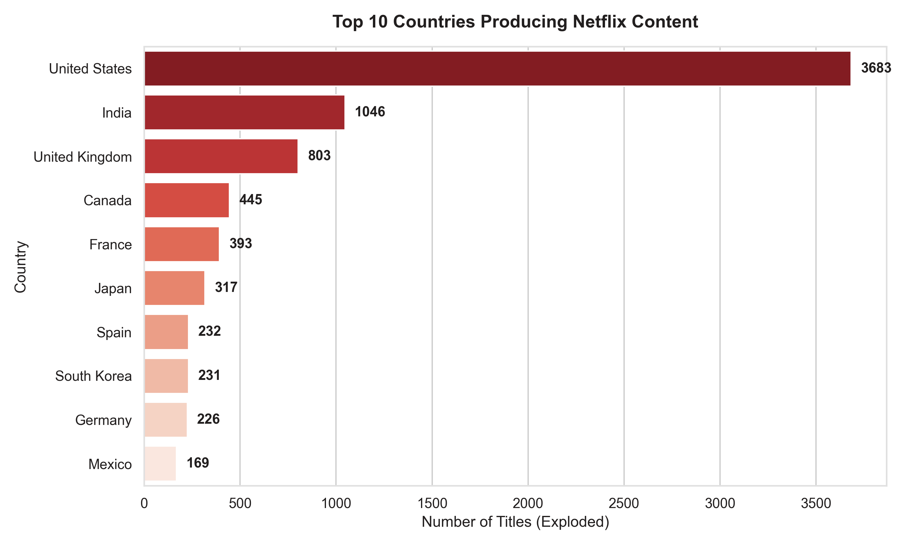

> 💡 **Business Insight:** 
> The United States is the primary content provider, but India (Bollywood) and the United Kingdom are massive secondary production engines. Investing in regional content creators (e.g., South Korea, Spain) allows Netflix to bypass saturated domestic markets and drive international subscriber acquisition.

---

### 3. Movie Runtimes & TV Show Longevity
We analyze the distribution of Movie runtimes (minutes) and TV Show lifespans (number of seasons).

| Movie Runtime Distribution (Histogram with KDE) | TV Show Seasons Distribution |
| :---: | :---: |
| 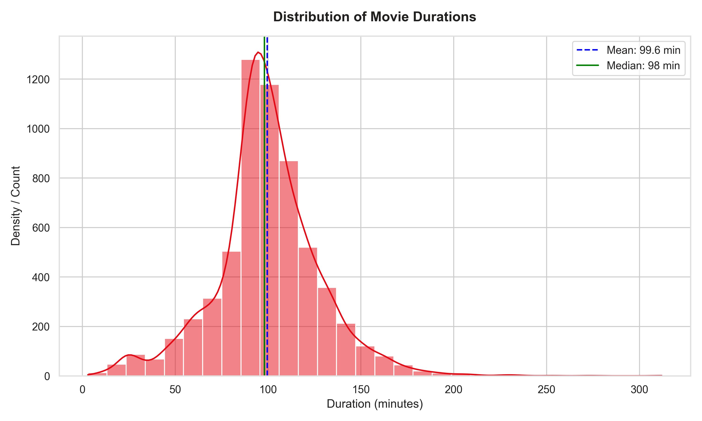 | *67.2% of shows end after Season 1*<br>*15.8% reach Season 2*<br>*7.4% reach Season 3*<br>*3.5% reach Season 4* |

> 💡 **Business Insight:** 
> The average Netflix movie is **99.6 minutes** long, indicating a viewer preference for standard 1.5-to-2-hour formats. 
> For TV shows, **67.3% end after a single season**. Early cancellations optimize budgets by weeding out low-engagement series, allowing Netflix to reinvest capital into fresh, hyped "Season 1" pilots that attract new sign-ups.

---

### 4. Content Growth & Seasonality Trends
Analyzing how the library has grown cumulatively, annually, and monthly.

| Cumulative Catalog Size | Annual Additions Trend | Monthly Upload Trend |
| :---: | :---: | :---: |
| 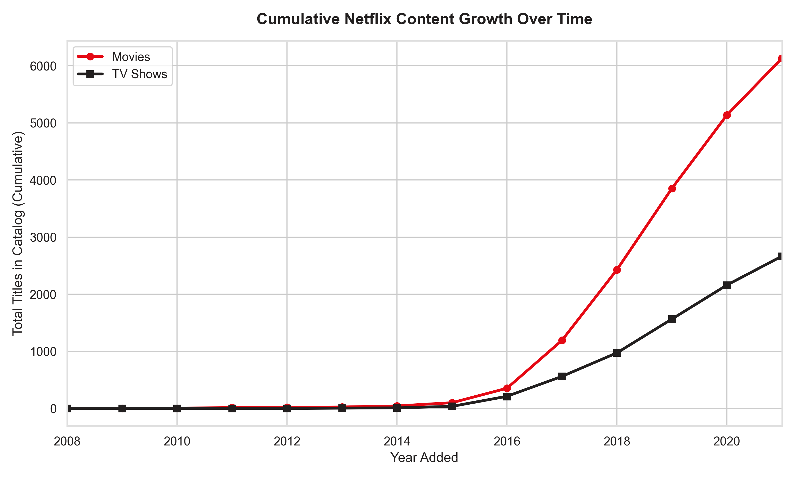 | 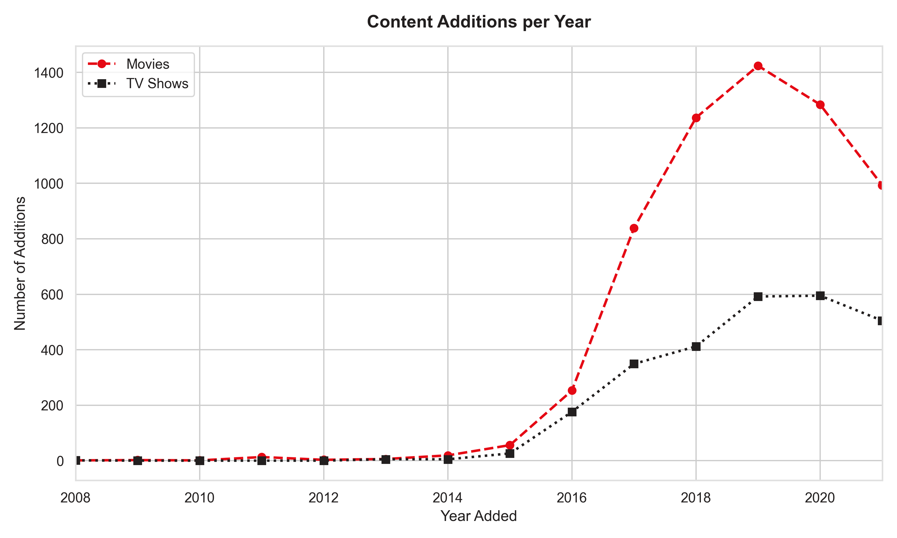 | 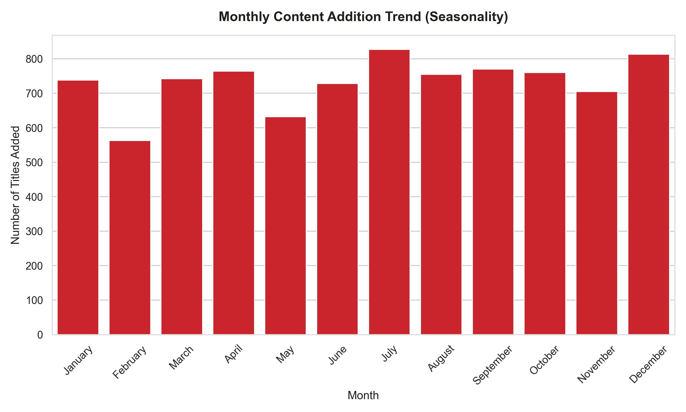 |

> 💡 **Business Insight:** 
> - **Platform Maturity**: Content additions peaked in 2019 and slightly decreased in 2020-2021. This reflects Netflix's strategic pivot from mass-licensing older external content to producing high-quality, exclusive Netflix Originals.
> - **Seasonality**: Uploads peak in July, December, and January. Netflix strategically releases major titles during summer and winter holiday windows when user leisure time—and streaming demand—is at its highest.

---

### 5. Audience Demographics & Genre Popularity
Analyzing content ratings and genre tags (exploded for multi-genre shows).

| Content Ratings Count | Top Genres Chart |
| :---: | :---: |
| 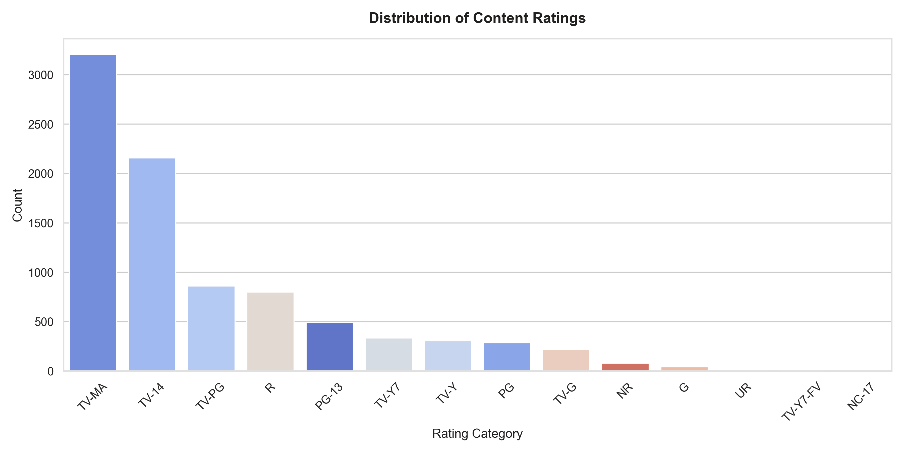 | 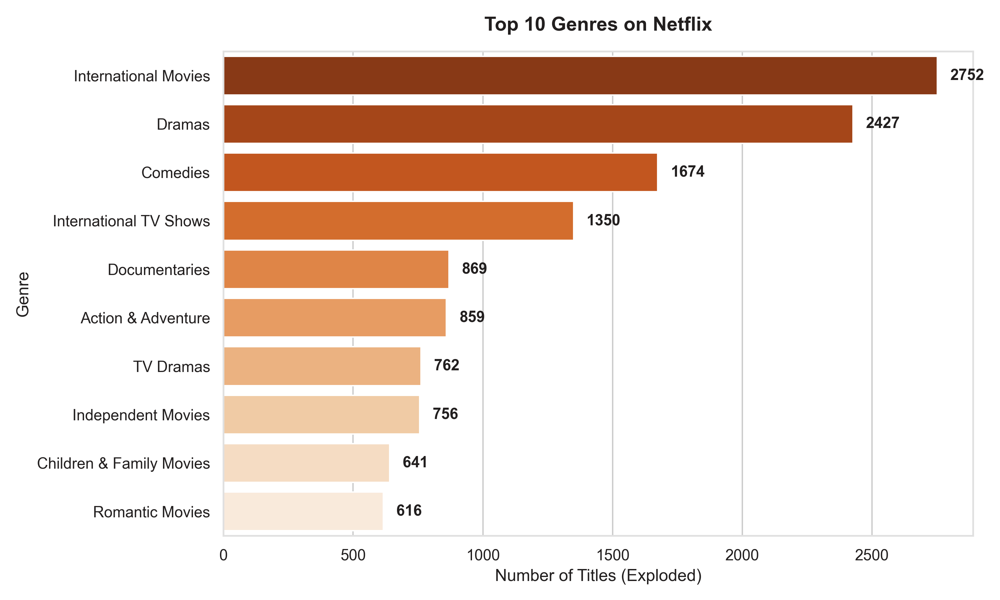 |

> 💡 **Business Insight:** 
> - **Audience Target**: `TV-MA` (Mature Audience) and `TV-14` (Teens) make up the vast majority of ratings. Netflix's core subscriber base consists of young adults and adults, explaining the heavy investment in dark dramas and mature comedies.
> - **Genre Focus**: Dramas, Comedies, and International Movies lead the genre catalog. International genres highlight Netflix's success in localizing content for global audiences.

---

### 6. Missing Data Assessment (Before & After Cleaning)
Heatmaps visualizing the state of missing values in the dataset.

| Before Data Cleaning | After Data Cleaning |
| :---: | :---: |
| 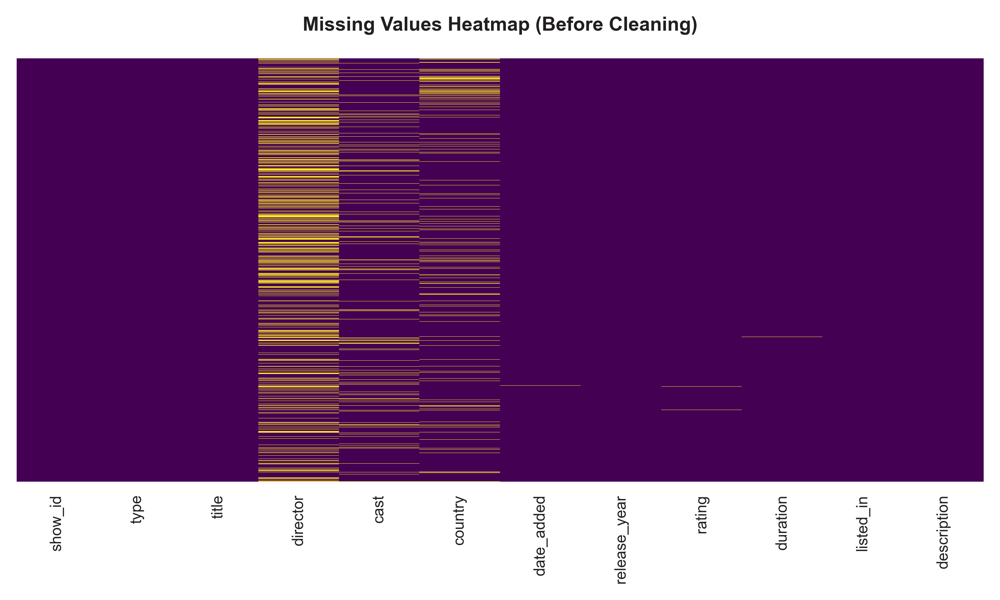 | 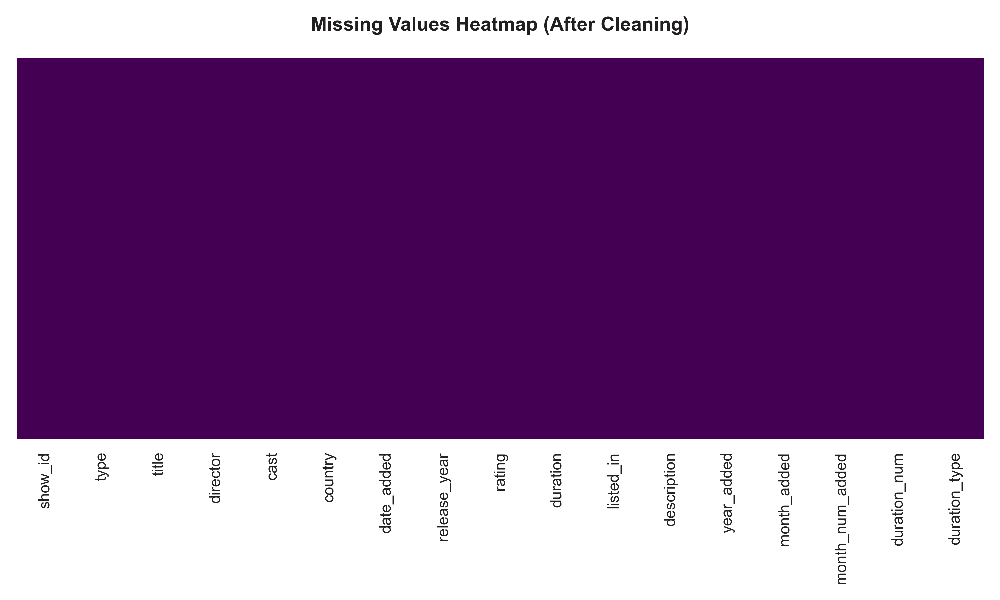 |

> 💡 **Verification:** 
> The cleaning process successfully resolved 100% of missing and shifted values across all target columns, ensuring the dataset is clean and ready for machine learning pipelines.

---

## 📈 Correlation Matrix

Below is the correlation heatmap for Netflix Movies.

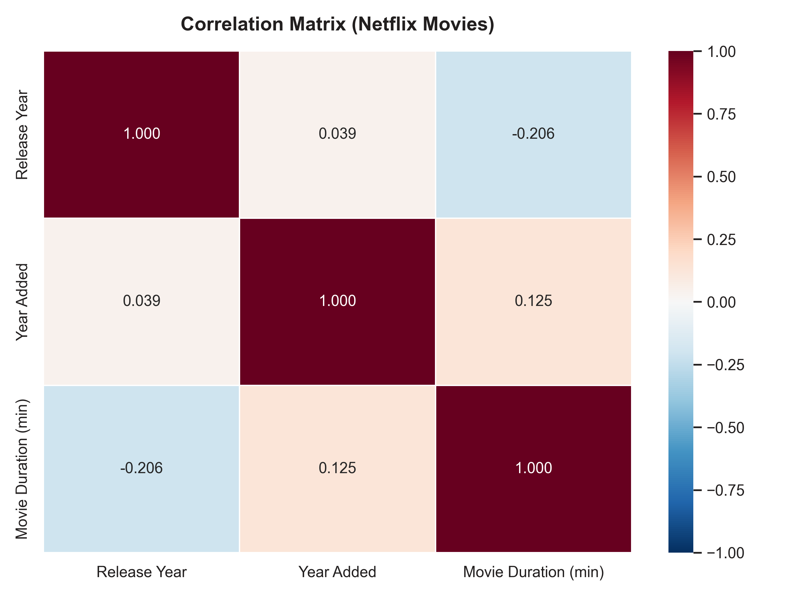

> 💡 **Business Insight:** 
> There is a slight negative correlation (-0.207) between a movie's `Release Year` and its `Movie Duration`. This statistical trend proves that modern movies added to Netflix tend to be shorter than older classic films, aligning with declining modern audience attention spans and the rise of fast-paced storytelling.

---

## 🚀 How to Run the Project Locally

### Prerequisites
Make sure you have Python 3.8+ installed on your computer.

### 1. Clone the Repository
```bash
git clone https://github.com/yourusername/netflix-data-analysis.git
cd netflix-data-analysis
```

### 2. Install Required Dependencies
```bash
pip install pandas numpy matplotlib seaborn
```

### 3. Run the Data Pipeline
Execute the main script to clean the data, output the analysis report, and generate all visualizations:
```bash
python netflix_analysis.py
```

---

## 📁 File Structure
```
netflix-data-analysis/
├── netflix_titles.csv       # Raw Netflix dataset (extract from dataset.zip)
├── netflix_analysis.py      # Main Python pipeline script (inspects, cleans, analyzes, and plots)
├── netflix_cleaned.csv     # Exported cleaned dataset (generated by script)
├── eda_report.txt          # Saved text output of the 14 EDA questions (generated by script)
├── README.md               # Professional GitHub project documentation
├── resume_description.md   # Resume bullet points and project summary
└── plots/                  # Directory containing 13 generated PNG visualizations
    ├── plot_1_movies_vs_tvshows.png
    ├── plot_2_top_countries.png
    ├── plot_3_top_genres.png
    ├── plot_4_content_type_donut.png
    ├── plot_5_movie_duration_dist.png
    ├── plot_6_release_year_dist.png
    ├── plot_7_ratings_distribution.png
    ├── plot_8_content_growth_over_time.png
    ├── plot_9_content_added_per_year.png
    ├── plot_10_missing_heatmap_before.png
    ├── plot_10_missing_heatmap_after.png
    ├── plot_11_correlation_heatmap.png
    └── plot_12_monthly_additions.png
```

---

## 💡 Strategic Business Recommendations

1. **Invest in TV Shows for Subscriber Retention:** While movies constitute 70% of the volume, TV shows generate longer, recurring engagement. Increasing original TV show productions can lower subscriber churn rates.
2. **Optimize Early Cancelation Policies:** Since 67.3% of series end after Season 1, continue using rigorous analytics to cancel low-performing shows early. Reallocate that budget into launching high-potential Season 1 pilots.
3. **Double-Down on High-Growth Hubs:** Expand regional production offices in South Korea, Spain, India, and Latin America. Exploded country metrics prove that local stories (e.g., *Squid Game*, *Money Heist*) possess high cross-border appeal and cost-efficiency.
4. **Targeted Seasonal Releases:** Continue scheduling tentpole series releases during the peak consumption windows of July and December/January to maximize organic reach and holiday viewing hours.

## Project Outcomes

- Cleaned and transformed raw Netflix metadata.
- Built an automated data-cleaning pipeline.
- Generated 12 business-focused visualizations.
- Extracted actionable insights from 8,800+ titles.
- Created a reusable analytics workflow.

## 📄 License

This project is licensed under the MIT License. See the LICENSE file for details.